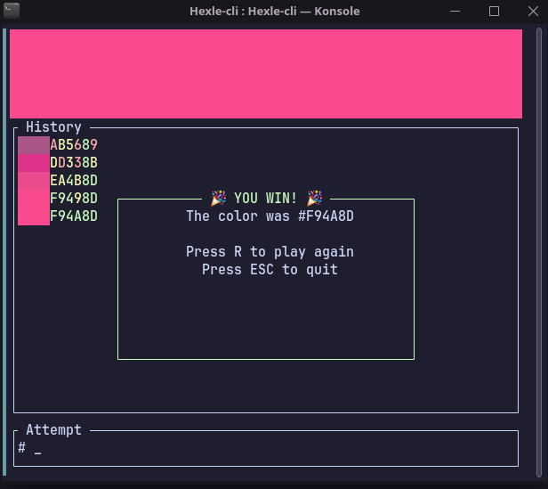

# Hexle-cli
A Terminal-based clone of [Hexcodle](https://hexcodle.com/) built in Rust.  
Guess the hex color in 5 attempts — each digit gives you feedback on how close you are.



## Gameplay
Each digit of your guess is colored:
- 🟩 **Green** — correct digit
- 🟨 **Yellow** — off by 1 or 2
- 🟥 **Red** — way off

## Install & Run
```bash
cargo install --path .
hexle
```

## Controls
Just type like you would normally, `ESC` is for exiting and `R` for restarting after you win or lose.

## Built with
- `ratatui` - TUI framework
- `crossterm` - Captures keyboard strokes and controls terminal
- `rand` - Used to generate a random color